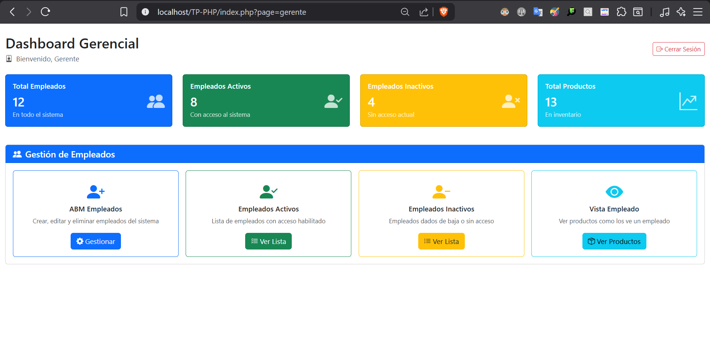
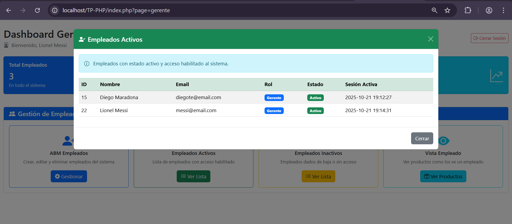
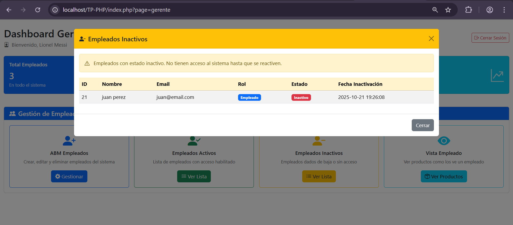
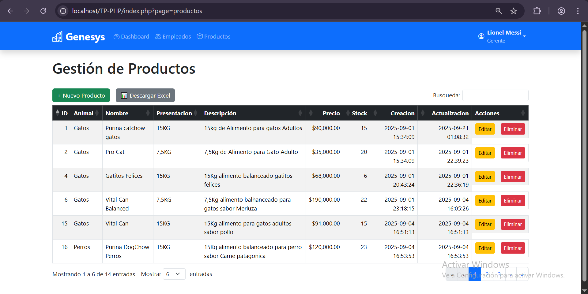
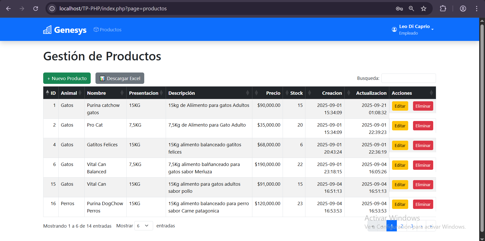

#  Genesys - Sistema de Gestión

Sistema de gestión integral para control de productos de mascotas y administración de empleados, desarrollado con arquitectura MVC y tecnologías web modernas.

## 📋 Descripción

Genesys es un sistema de gestión empresarial que permite administrar de manera eficiente el inventario de productos para mascotas y la información del personal. El sistema cuenta con diferentes niveles de acceso según el rol del usuario, optimizando las operaciones diarias de la empresa.

### Funcionalidades Principales

- **Gestión de Productos**: CRUD completo para productos de mascotas con control de entrada y salida de inventario
- **Gestión de Empleados**: Administración completa de la información del personal
- **Dashboard Gerencial**: Panel con métricas y datos relevantes del negocio
- **DataTables**: Tablas interactivas con búsqueda, paginación y ordenamiento
- **Exportación de Datos**: Descarga de información en formatos PDF y Excel
- **Sistema de Roles**: Diferenciación entre empleado y gerente (en desarrollo)

## 🛠️ Tecnologías Utilizadas

### Backend
- **PHP** - Lenguaje de programación del lado del servidor
- **PDO (PHP Data Objects)** - Capa de abstracción para acceso a base de datos
- **MySQL** - Sistema de gestión de base de datos

### Frontend
- **Bootstrap 5** - Framework CSS para diseño responsive
- **DataTables** - Plugin jQuery para tablas interactivas
- **HTML5 & CSS3** - Estructura y estilos

### Arquitectura
- **Patrón MVC** (Model-View-Controller) - Separación de lógica de negocio
- **Sistema de Rutas** - Enrutamiento mediante `routes/web.php`
- **POO** (Programación Orientada a Objetos) - Código estructurado y reutilizable

## 📊 Metodologías y Herramientas

### Metodología de Desarrollo
- **Kanban** - Gestión ágil de tareas y flujo de trabajo

### Herramientas
- **Visual Studio Code** - Editor de código
- **Git** - Control de versiones
- **GitHub** - Repositorio remoto y colaboración
- **Trello** - Gestión de proyecto y seguimiento de tareas
- **XAMPP** - Entorno de desarrollo local (Apache + MySQL + PHP)


## 🚀 Instalación y Configuración

### Requisitos Previos

- **XAMPP** (incluye PHP y MySQL)
- Navegador web moderno
- Git (opcional, para clonar el repositorio)

### Pasos de Instalación

1. **Descargar e instalar XAMPP**
   ```
   Descarga XAMPP desde: https://www.apachefriends.org/
   ```

2. **Clonar o descargar el proyecto**
   ```bash
   git clone [URL-del-repositorio]
   ```
   O descarga el ZIP y extrae en la carpeta `htdocs` de XAMPP

3. **Mover el proyecto a htdocs**
   ```
   Copiar la carpeta del proyecto a: C:/xampp/htdocs/genesys
   ```

4. **Iniciar servicios de XAMPP**
   - Abre el Panel de Control de XAMPP
   - Inicia los módulos **Apache** y **MySQL**

5. **Importar la Base de Datos**
   - Abre tu navegador y accede a: `http://localhost/phpmyadmin`
   - Crea una nueva base de datos (si es necesario)
   - Selecciona la base de datos creada
   - Ve a la pestaña **Importar**
   - Selecciona el archivo `sistema_gestion.sql` ubicado en la raíz del proyecto
   - Haz clic en **Continuar** para importar

6. **Acceder al Sistema**
   ```
   Abre tu navegador y visita: http://localhost/genesys
   ```

## Algunas Imagenes






## 📊 Dashboard Gerencial

El dashboard proporciona una vista general del estado del negocio con las siguientes métricas:

- **Total de Empleados**: Cantidad total de personal registrado
- **Empleados Activos**: Personal en estado activo
- **Empleados Inactivos**: Personal en estado inactivo
- **Total de Productos**: Inventario total de productos

## 👥 Roles y Permisos

### Empleado
- Gestión completa de productos (entrada/salida de inventario)
- Visualización de inventario
- Exportación de datos

### Gerente
- Acceso completo a todas las funcionalidades
- Gestión de empleados
- Visualización del dashboard gerencial
- Gestión de productos
- Reportes y estadísticas

> **Nota**: El sistema de autenticación y login está actualmente en desarrollo

## 🔧 Configuración

Las credenciales de la base de datos ya están configuradas en el proyecto. Solo es necesario:

1. Importar el archivo `sistema_gestion.sql`
2. Verificar que los servicios de XAMPP estén activos
3. Acceder al sistema desde el navegador

## 📝 Características Técnicas

### DataTables
Todas las tablas del sistema incluyen:
- 🔍 Búsqueda en tiempo real
- 📄 Paginación automática
- ⬆️⬇️ Ordenamiento por columnas
- 📥 Exportación a PDF
- 📊 Exportación a Excel

### Seguridad
- Preparación de consultas con PDO (prevención de SQL Injection)
- Arquitectura MVC para separación de responsabilidades
- Validaciones en servidor

## 🐛 Solución de Problemas

### Error de conexión a la base de datos
- Verifica que MySQL esté corriendo en XAMPP
- Confirma que importaste el archivo `sistema_gestion.sql`
- Revisa las credenciales en el archivo de configuración

### Página en blanco
- Verifica que Apache esté iniciado
- Revisa la ruta del proyecto en htdocs
- Comprueba los logs de error de PHP

### DataTables no funcionan
- Verifica la conexión a internet (CDN de librerías)
- Revisa la consola del navegador para errores JavaScript

## 📄 Licencia

Este proyecto es de uso educativo y privado.

---

**Desarrollado con ❤️ usando PHP, MySQL y Bootstrap 5**